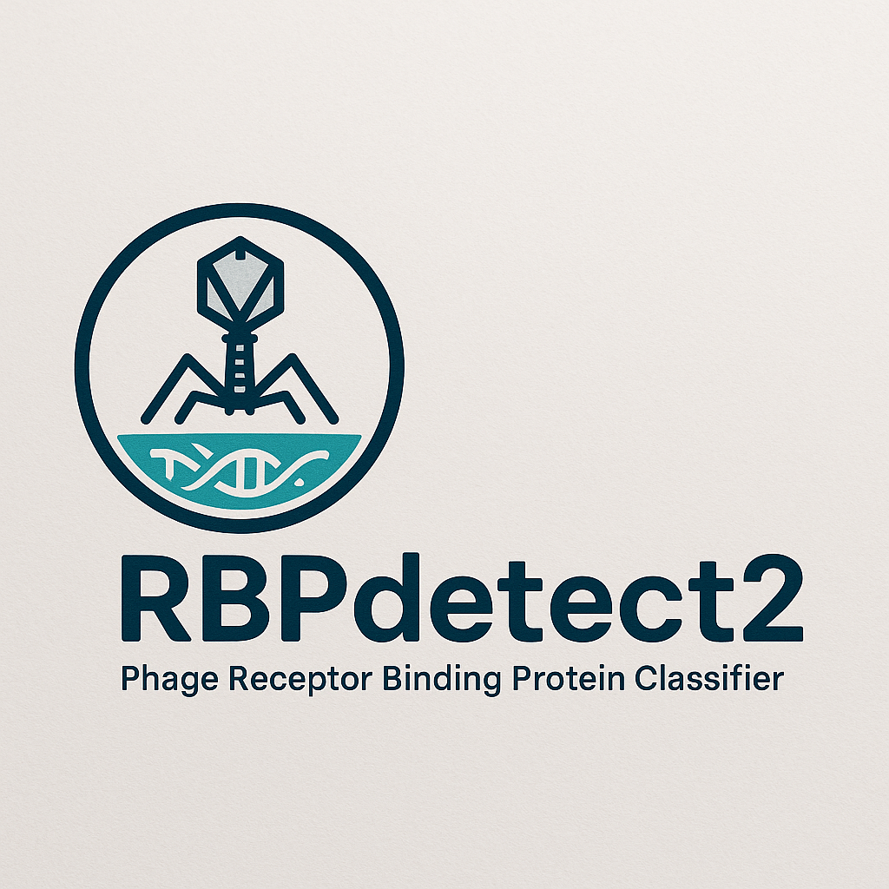

[](https://colab.research.google.com/github/victornemeth/RBPdetect2/blob/main/RBPdetect2_streamlined.ipynb)

<div align="center">

# RBPdetect2

## Identify Tailspike and Tail Fiber Proteins in Bacteriophages



A **fast**, **easy-to-use** tool for identifying phage **receptor binding proteins (RBPs)** — including **tailspikes** and **tail fibers** — built with ESM2.

</div>

---
 
## Easiest way to get started

I have provided a Google Colab Notebook [](https://colab.research.google.com/github/victornemeth/RBPdetect2/blob/main/RBPdetect2_streamlined.ipynb), where you can upload your genome/protein fasta and use the RBPdetect2 tools to classify RBPs. Simply follow the instructions on the Colab page.


## Overview

**RBPdetect2** classifies bacteriophage proteins into one of three categories:

| Label       | Value | Description                             |
|-------------|-------|-----------------------------------------|
| Non-RBP     | **0** | Not a receptor-binding protein          |
| Tail Fiber  | **1** | A phage tail fiber protein              |
| Tail Spike  | **2** | A phage tail spike protein              |

---

## Installation

Clone the repository and install dependencies:

```bash
git clone https://github.com/victornemeth/RBPdetect2.git
cd RBPdetect2
conda env create -f environment.yml
conda activate rbpdetect2
```

## Quick Start
Run RBP classification on a FASTA file:

```bash
python inference_parallel.py ./final_esm2_classifier sequences.fasta -o output.tsv -b 64
```
- `-o`: Output file path (.tsv)

- `-b`: Batch size (default: 64)

## Benchmark

| Method                     | F1 score | MCC score | Sensitivity | Specificity |
| -------------------------- | -------- | --------- | ----------- | ----------- |
| RBP domains (HMMs)         | 72.0%    | 70.2%     | 66.4%       | 98.5%       |
| PhANNs                     | 69.8%    | 67.9%     | 81.6%       | 95.8%       |
| ProtTransBert+XGBoost      | 84.0%    | 82.3%     | 91.6%       | 97.9%       |
| ProtTransBert+HMMs+XGBoost | 84.8%    | 83.8%     | 92.2%       | 98.0%       |
| ESM-2 + XGBoost            | 85.0%    | 83.9%     | 90.9%       | 98.1%       |
| RBPdetect (T33)      | 86.4%    | 85.4%     | 91.6%       | 98.4%       |
| RBPdetect Finetuned 2025       | 91.7%    | 90.3%     | 93.8%       | 98.1%       |
| RBPdetect2                 | 98.8%    | 94.4%     | 97.1%       | 98.4%       |


## Citation
Comming soon

## License
[MIT License](https://opensource.org/license/mit)
